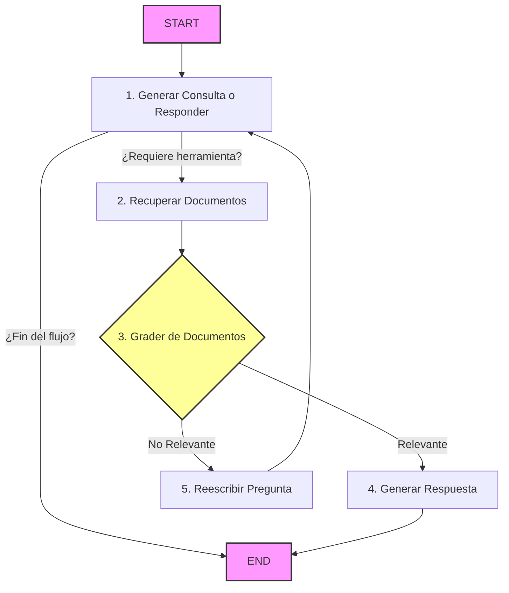

# 🤖 Agentic RAG con LangGraph

Una implementación modular de **RAG Agéntico Auto-Correctivo (Corrective RAG - CRAG)** utilizando **LangGraph**, **LangChain** y **OpenAI**. El sistema evalúa de forma autónoma la relevancia de la información recuperada y decide si debe responder de inmediato, reescribir la pregunta original para mejorar la búsqueda, o solicitar más contexto a través de herramientas de recuperación.

---

## 📐 Arquitectura del Sistema

El flujo del agente sigue el siguiente diagrama de estados, en el cual las decisiones de enrutamiento y evaluación se ejecutan automáticamente en base al contexto obtenido:



---

## 🗂️ Estructura del Proyecto

El proyecto está diseñado bajo una arquitectura modular que separa la configuración, la ingesta de datos, el flujo de estados de LangGraph y los prompts:

*   **`config.py`**: Carga las variables de entorno e inicializa los clientes de los LLMs (`gpt-4o-mini`) y modelos de embeddings.
*   **`database.py`**: Descarga dinámicamente artículos de referencia, realiza el procesamiento/segmentación del texto (`RecursiveCharacterTextSplitter`) e inicializa la base de datos vectorial en memoria.
*   **`tools.py`**: Define la herramienta (`retrieve_blog_posts`) que permite al agente realizar búsquedas semánticas.
*   **`nodes.py`**: Agrupa la lógica individual de cada estado (generación de respuestas, reescritura de preguntas y evaluación de relevancia).
*   **`graph.py`**: Define la topología del flujo, las transiciones condicionales y compila la máquina de estados.
*   **`main.py`**: Punto de entrada ejecutable desde consola que maneja la entrada de usuario y muestra el flujo de razonamiento del agente paso a paso.

---

## 🚀 Instalación y Configuración

El proyecto utiliza **Poetry** para la gestión de dependencias y entornos virtuales.

### Prerrequisitos

*   Python `>= 3.14` (o la versión activa en tu entorno)
*   Una clave de API de OpenAI

### Pasos de Configuración

1.  **Instalar Dependencias**:
    Asegúrate de estar en el directorio raíz del proyecto y ejecuta:
    ```bash
    poetry install
    ```

2.  **Configurar Variables de Entorno**:
    Copia el archivo de ejemplo para crear tu `.env`:
    ```bash
    cp .env.example .env
    ```
    Abre el archivo `.env` recién creado y añade tu OpenAI API key:
    ```env
    OPENAI_API_KEY=tu-openai-api-key-aquí
    ```

---

## 💻 Ejecución

Puedes ejecutar el agente utilizando el comando nativo de Poetry.

### Consulta por defecto

Ejecuta el script con la consulta del tutorial por defecto (relacionada con *Reward Hacking* en los blogs de Lilian Weng):
```bash
poetry run python main.py
```

### Consulta personalizada

Puedes pasarle cualquier pregunta al agente directamente a través de argumentos de línea de comando:
```bash
poetry run python main.py "¿Qué opina Lilian Weng sobre la alucinación en LLMs?"
```

---

## 🛠️ Cómo Extender el Sistema

La modularidad del diseño facilita realizar adaptaciones rápidas:

*   **Conectar una Base de Datos Vectorial Persistente**:
    Edita la función `_build_retriever()` en `database.py` para reemplazar `InMemoryVectorStore` por clientes de bases de datos como **ChromaDB**, **Pinecone** o **Qdrant**.
*   **Añadir Nuevas Fuentes de Información**:
    Modifica la lista de `urls` en `database.py` para apuntar a otros artículos o integra cargadores de PDFs / archivos locales utilizando `langchain_community.document_loaders`.
*   **Agregar Herramientas**:
    Define nuevos métodos con el decorador `@tool` en `tools.py` y agrégalos a la lista de herramientas en `nodes.py` vinculadas a tu LLM.
*   **Ajustar Criterios de Evaluación**:
    Modifica el prompt `GRADE_PROMPT` en `nodes.py` para endurecer o flexibilizar las reglas con las cuales el agente califica si un documento es relevante.
