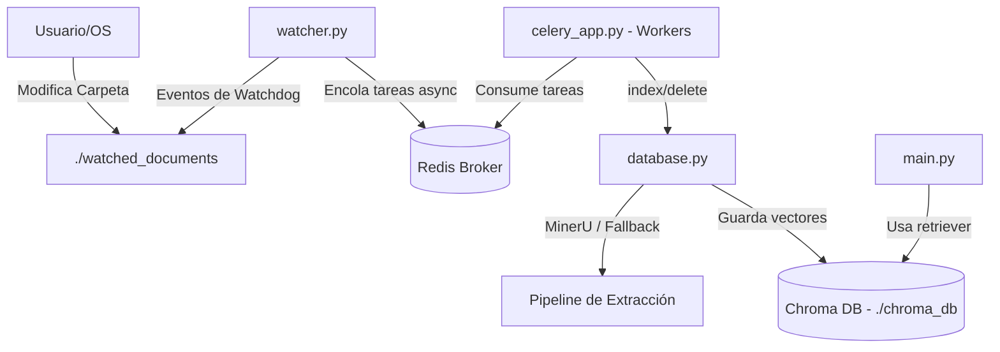

# 🤖 Agentic RAG con LangGraph y Sincronización Asíncrona (Celery + Watchdog)

Una implementación de producción de **RAG Agéntico Auto-Correctivo (Corrective RAG - CRAG)** utilizando **LangGraph**, **LangChain** y **OpenAI**, optimizada para el procesamiento masivo de documentos en tiempo real. 

El sistema utiliza **Watchdog** para monitorizar directorios en tiempo real, **Celery** y **Redis** para encolar de forma asíncrona la extracción y vectorización de documentos (soportando **MinerU**), y persiste los embeddings en una base de datos local **Chroma**.

---

## 📐 Arquitectura del Sistema



---

## 🗂️ Estructura del Proyecto

El proyecto está diseñado bajo una arquitectura modular desacoplada:

*   **`config.py`**: Configuración general, variables de entorno (API keys, URLs de Redis) e inicialización de modelos.
*   **`database.py`**: Pipeline de ingesta. Soporta extracción de PDF de alta calidad con **MinerU** (`magic-pdf`) con fallback automático a cargadores estándar. Administra e indexa los vectores de forma persistente en **Chroma**.
*   **`tools.py`**: Herramienta de búsqueda semántica (`retrieve_blog_posts`) expuesta al agente.
*   **`nodes.py`**: Lógica de los estados del agente (enrutamiento de consultas, grading de relevancia, reescritura de preguntas y generación).
*   **`graph.py`**: Estructura de LangGraph y compilación de la máquina de estados.
*   **`celery_app.py`**: Aplicación de Celery que define las tareas en segundo plano para procesar e indexar documentos.
*   **`watcher.py`**: Demonio que vigila cambios en el directorio local y los envía a la cola.
*   **`main.py`**: Entrada ejecutable por consola para realizar consultas al agente.

---

## 🚀 Instalación y Configuración

El proyecto gestiona sus dependencias utilizando **Poetry**.

### 1. Prerrequisitos

*   Python `>= 3.14` (o versión activa en tu entorno)
*   **Redis** (Ej. corriendo en Docker)
*   Clave de API de OpenAI

### 2. Configuración inicial

1.  **Instalar dependencias**:
    ```bash
    poetry install
    ```

2.  **Configurar variables de entorno**:
    Copia el archivo de ejemplo para crear tu `.env`:
    ```bash
    cp .env.example .env
    ```
    Edita `.env` e introduce tus credenciales:
    ```env
    OPENAI_API_KEY=tu-openai-api-key-aquí
    REDIS_URL=redis://localhost:6379/0
    ```

---

## 💻 Ejecución del Entorno Completo

Para ejecutar la sincronización y el RAG en tiempo real, necesitarás abrir 3 terminales:

### Terminal 1: Broker de Redis
Levanta un contenedor de Redis si no tienes uno activo:
```bash
docker run -d --name redis-broker -p 6379:6379 redis
```

### Terminal 2: Worker de Celery
Ejecuta el worker que procesará los documentos en segundo plano. En Windows es necesario especificar el pool `solo`:
```bash
poetry run celery -A celery_app worker --loglevel=info --pool=solo
```

### Terminal 3: Guardián de Directorio (Watcher)
Inicia la monitorización en tiempo real de tu carpeta local:
```bash
poetry run python watcher.py
```

*(Por defecto vigilará la carpeta recién creada `./watched_documents`)*.

---

## 🔍 Prueba de Sincronización en Tiempo Real

1.  **Indexación**: Copia cualquier documento (PDF, TXT, MD, HTML) dentro de la carpeta `watched_documents/`.
    *   Verás al instante en la consola del *Watcher* la detección del archivo.
    *   El *Worker* de Celery recibirá la tarea, extraerá el texto (usando **MinerU** si el comando `magic-pdf` está disponible, o un lector básico de PDF en su defecto), generará embeddings y guardará los vectores en `./chroma_db`.
2.  **Consulta**: Ejecuta el RAG preguntando sobre el documento que acabas de subir:
    ```bash
    poetry run python main.py "Pregunta específica sobre tu documento..."
    ```
3.  **Eliminación**: Borra el documento de `watched_documents/`. El sistema eliminará automáticamente de forma asíncrona todos sus vectores en Chroma, garantizando que el agente no use información desactualizada.
